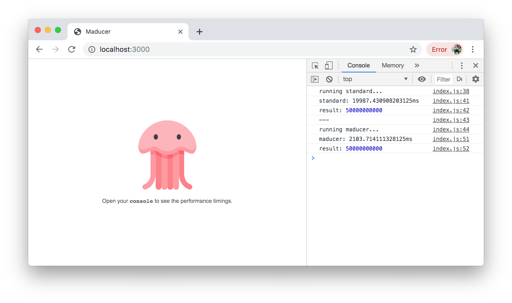

# Maducer

> An experimental map-reduce concurrency over web workers using shared array buffer for handling large datasets.


&nbsp;

&nbsp;

&nbsp;

&nbsp;
[](https://github.com/prettier/prettier)



---

## Getting Started

Maducer has a similar interface to the native implementation &ndash; define your mapping and reducing functions, and additionally instruct Maducer how to split your data into logical chunks.

[](https://codesandbox.io/s/maducer-h3qds?fontsize=14)

```javascript
// Configure how to map and reduce your data.
const mapper = a => Number(a);
const reducer = (a, b) => a > b ? a : b;

// Load data from a file, API or some place else.
const data = await fetch('./dataset.csv').then(r => r.text());

// Define how your data is delimited.
const delimiter = ',';

// Put it all together and compute the highest value.
const compute = maducer(delimiter, mapper, reducer);
const result = await compute(data);
console.log('Highest value is:', result);
```

Maducer will distribute the concurrent map-reduce computation across *x* [web workers](https://developer.mozilla.org/en-US/docs/Web/API/Web_Workers_API/Using_web_workers) using [`SharedArrayBuffer`](https://developer.mozilla.org/en-US/docs/Web/JavaScript/Reference/Global_Objects/SharedArrayBuffer) where *x* is the amount of CPU cores available to the client.

It's also possible to pass an `ArrayBuffer` to Maducer &ndash; you'll still get the decoded value in your map and reduce functions, but there is a performance gain in using a buffer as opposed to plain text &ndash; using `fetch` you can yield a buffer by using `response.arrayBuffer()`.